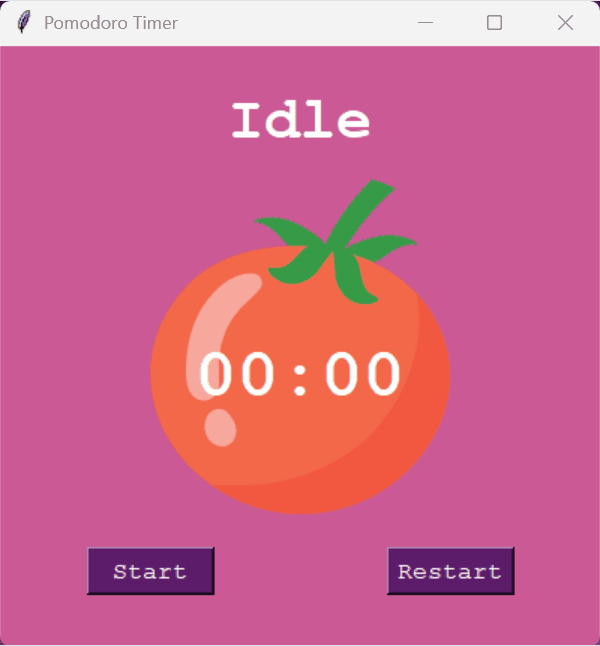
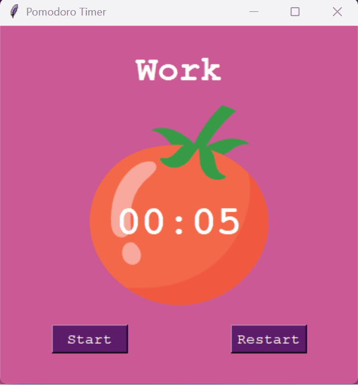

# 🍅 Pomodoro Timer (Python)

A simple and clean **Pomodoro Timer desktop application** built with Python to help improve focus and productivity using the Pomodoro technique. The application provides a distraction-free interface with automated work and break cycles, making it easier to manage time effectively.

---

## ⏳ What is the Pomodoro Technique?

The Pomodoro Technique is a time management method where you:

- Work for **25 minutes**
- Take a **5-minute break**
- After 4 sessions, take a **longer break**

This structured approach helps maintain concentration and prevents burnout.

---

## 🎯 Features

- ⏱ Start / Reset timer functionality  
- 🔁 Automatic switching between work & break sessions  
- 🧠 Session tracking with visual indicators  
- 🖼 Clean GUI built with Tkinter  
- 🍅 Custom timer visuals (image support)  

---

## 🛠 Tech Stack

- **Python**
- **Tkinter (GUI)**

---

## 📦 Installation & Setup

### 1. Clone the repository
```bash
git clone https://github.com/dasatti/pomodoro-timer.git
cd pomodoro-timer
```

### 2. Run the application
```bash
python pomodoro.py
```

## ⬇️ Download
You can download the latest version of the application from the releases section:

👉 https://drive.google.com/drive/folders/1nwCjc8S71XFrKUFuqbU-vXLezODXo94v?usp=sharing

## 📸 Preview





## 👨‍💻 Author

Danish Satti

 - GitHub: https://github.com/dasatti
 - LinkedIn: https://linkedin.com/in/danishsatti

## 🤝 Contributing

Contributions, issues, and feature requests are welcome.

## 📄 License

This project is open-source and available under the MIT License.